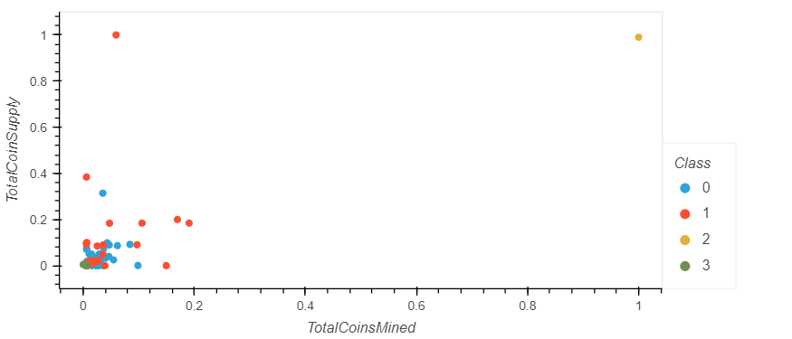

# Cryptocurrencies Analysis

This analysis used K means clustering to classify different types of cryptocurrency based on its principal components. The results were then mapped onto 3d and 2d scatter plots.

  
