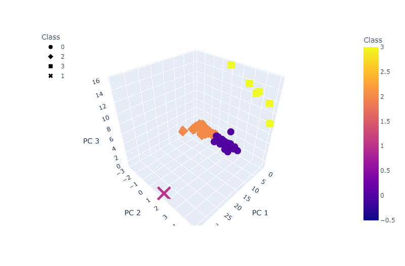

# Cryptocurrencies Analysis

This analysis used K means clustering to classify different types of cryptocurrency based on its principal components. The results were then mapped onto 3d and 2d scatter plots.
 
Code sample: Using PCA to consolidate features.
 

  
Final Plots:
 

  
